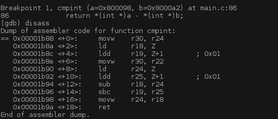

Embedded GDB server for AVR MCU
===============================

Embedded GDB server implementation for 8-bit AVR MCU for debugging
thru UART.

### Usage:

GDB server on the running AVR MCU can be accessed using UART:

    $ avr-gdb gdb.elf
    GNU gdb (GDB) 7.4

    (gdb) set remotebaud 9600
    (gdb) target remote /dev/ttyUSB0`

Full usage example can be seen here: https://youtu.be/36OgekfiLLc

### How it works:

The operational principle is simple: UART RX is parsed by gdb.c and GDB
commands are expected on the wire.  When breakpoint is sent from GDB client,
code is modified on that address, EEPROM is updated and original instruction
is replaced with a trap opcode, which actually is RJMP on iself to make
program spin on that address.  Meanwhile each second timer interrupt happens
and checks where MCU was interrupted, if interruption address is equal to
one of the breakpoints - gdb.c sends to the GDB client special GDB_SIGTRAP
state using UART TX, which indicates that breakpoint was hit.

### Disclaimer:

Code is just an experiment and written for fun, so I did not do any attempts
to make it architecture independent.  Also because this is completely software
implemention without any HW support I fully utilize UART and one timer interrupt.
And yes a lot of code which occupies quite a lot EEPROM.  What a bummer.

### Author

Roman Pen <r.peniaev@gmail.com>
